# Duel links meta app

## Futures

- Tier List Page
- Deck Type Detail Page
- Top Deck page
- Deck detail page
- Ban list change page
- Ban list cards page
- Article list page
- Pack set list page
- Pack set detail page
- Dark mode and theme color
- Data local cache for fast viewing and reduce the api fetching

## Screenshot
| 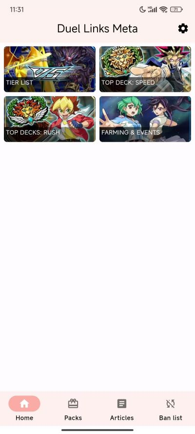       | 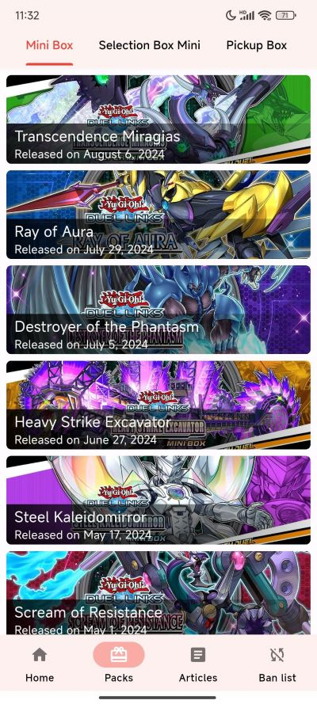 | 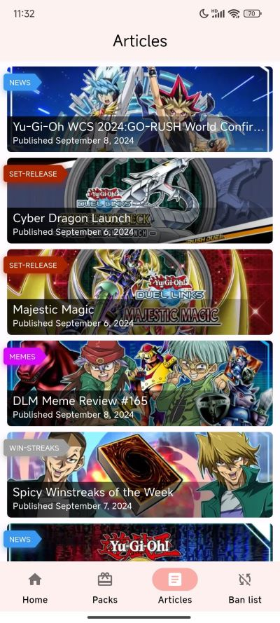 |
|----------------------------------------------------| ------- |----------------------------------------|
| 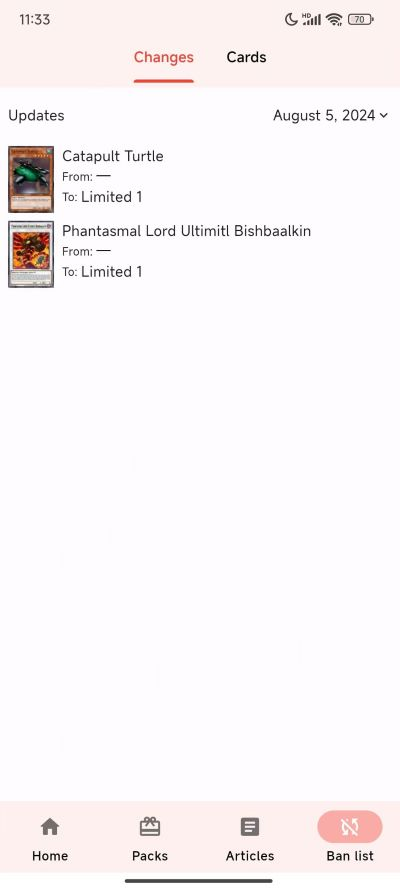 | 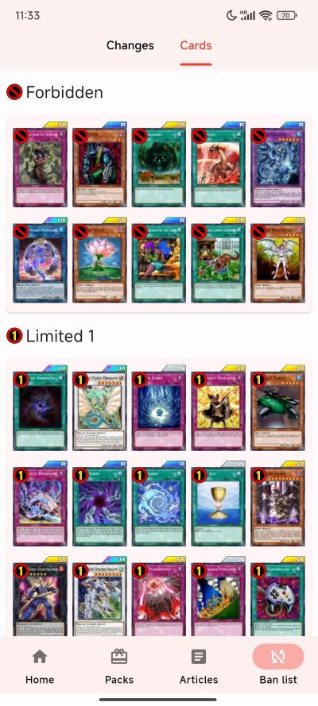 | 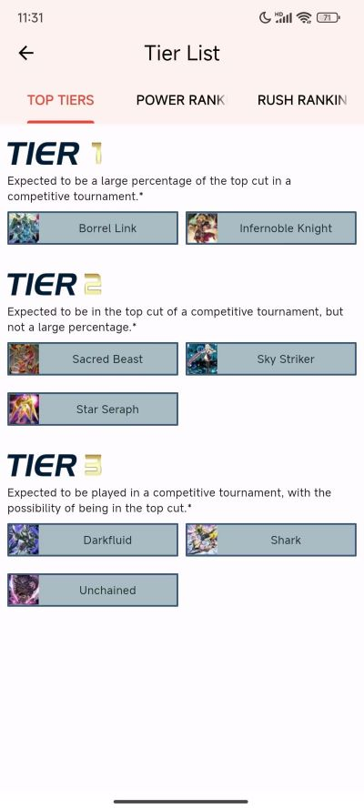 |
| 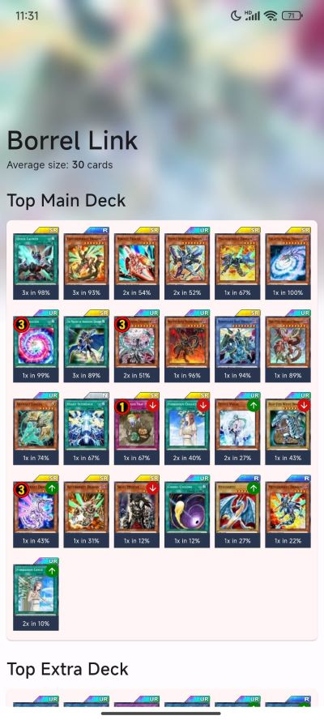 | 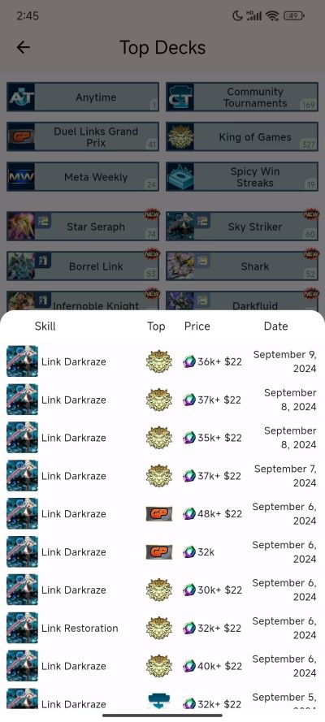 | 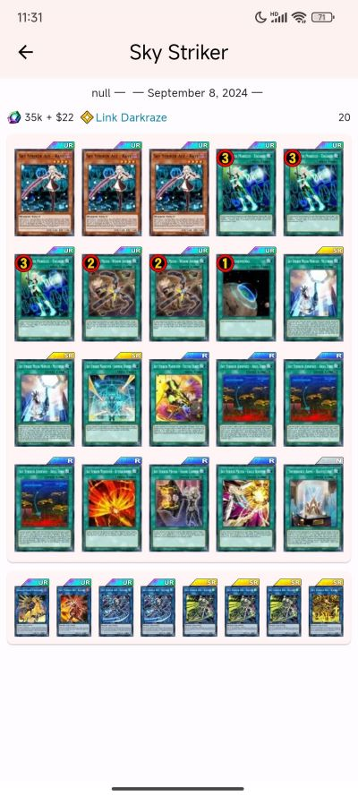 |
| 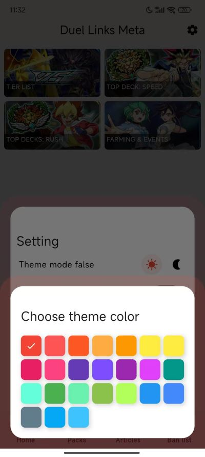 | 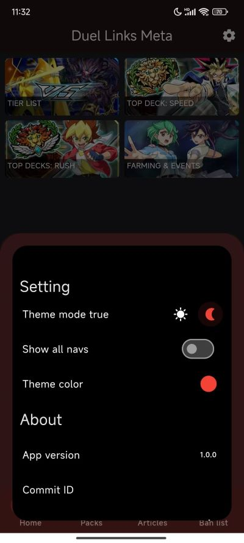    | 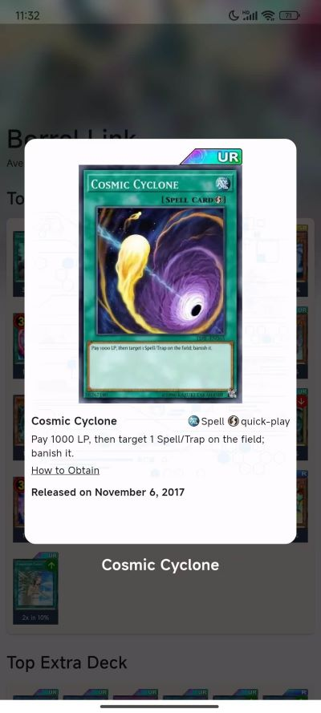 |

## Download 下载

[Download from github (从github下载)](https://github.com/sukinosuki/duel-links-meta-flutter-app/releases)

## Stars

If this project is helpful to you, please consider giving a star for support.

如果本项目对你有帮助的话, 可以`star`支持一下.

## Data source

The app utilizes the following resources from [Duel Links Meta](https://www.duellinksmeta.com)、[Konami]()、[deviantart](https://www.deviantart.com/tag/masterduel):

- **APIs**: The app integrates with Duel Links Meta's APIs to fetch deck lists, card details, and other game-related data.
- **Images**: Card images and other graphics used in the app are sourced directly from Duel Links Meta、konami、deviantart.

## License

该项目仅供学习交流，请于下载后24小时内删除，使用应遵循当地法律法规，请勿用于违法用途。
